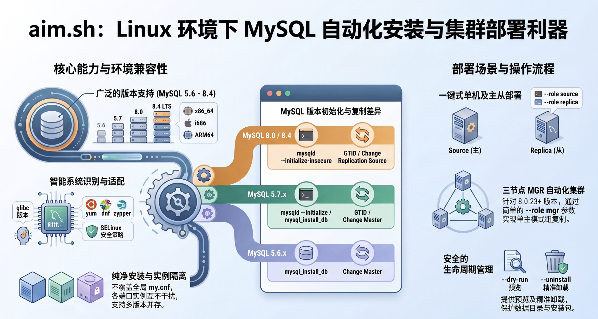

# aim.sh

`aim.sh` 使用 Oracle MySQL Community Server 官方通用二进制包，在一台 Linux 主机上安装相互隔离的 MySQL 实例。支持单机、主库、GTID 从库，以及 MySQL 8.0 单主模式 MGR。



## 支持范围

| MySQL | x86_64 | i686 | ARM64 | 初始化方式 | 复制命令 |
|---|---:|---:|---:|---|---|
| 5.6.x | 是 | 否 | 否 | `mysql_install_db` | `CHANGE MASTER` / `START SLAVE` |
| 5.7.x | 是 | 否 | 否 | 5.7.6 前使用 `mysql_install_db`，之后使用 `mysqld --initialize-insecure` | `CHANGE MASTER` / `START SLAVE` |
| 8.0.x | 是 | 是 | 是 | `mysqld --initialize-insecure` | 8.0.23 起使用 `CHANGE REPLICATION SOURCE` |
| 8.4.x | 是 | 是（以官网实际发布为准） | 是 | `mysqld --initialize-insecure` | `CHANGE REPLICATION SOURCE` / `START REPLICA` |

操作系统支持 RHEL/CentOS/Rocky/AlmaLinux/Oracle Linux、Debian/Ubuntu、SLES/openSUSE 等 glibc Linux。脚本自动识别 `dnf`、`yum`、`apt` 或 `zypper`，并识别 x86_64、i686 和 aarch64。Alpine 等 musl 系统不能直接运行 Oracle 通用二进制包，因此会在安装前明确退出。

在启用 SELinux 的 RHEL 系统上，脚本会为自定义数据、日志、临时目录和非默认 TCP 端口配置持久上下文；缺少管理工具时会安装发行版对应的 policycoreutils 包或给出明确错误。

MySQL 5.6/5.7 已停止官方维护。脚本仍支持安装归档版本，但生产环境应优先选择仍受支持的 8.0/8.4，并自行承担旧版本安全和系统动态库兼容风险。

## 获取脚本

在线安装只需要下载 `aim.sh`，默认参数已经内置，不依赖仓库中的其他文件：

```bash
wget -O aim.sh \
  https://raw.githubusercontent.com/aimdotsh/aim/master/aim.sh
chmod +x aim.sh
```

同一个 `aim.sh` 也负责卸载，不需要其他脚本：

```bash
sudo ./aim.sh --uninstall -v 8.0.46 -p 8046 --dry-run
sudo ./aim.sh --uninstall -v 8.0.46 -p 8046 --yes
```

配置文件不是必需的。如需固定目录、角色等参数，下载样例并重命名为与脚本同目录的 `aim.conf`，脚本会自动读取：

```bash
wget -O config.sample \
  https://raw.githubusercontent.com/aimdotsh/aim/master/config.sample
cp config.sample aim.conf
chmod 600 aim.conf
```

也可以通过 `-c /path/to/custom.conf` 指定其他受信任配置。MySQL 安装包会自动下载到脚本所在目录的 `media/`，也可以提前放入该目录进行离线安装。

## 快速开始

使用精确的三段版本号：

```bash
# 单机
sudo ./aim.sh -v 8.4.5 -p 3306 --role standalone

# 主库：创建只允许 10.0.0.12 使用的复制账号
sudo ./aim.sh -v 8.0.42 -p 3306 --role source \
  --replica-host 10.0.0.12 --repl-password 'replace-me'

# 从库：连接刚安装、尚无业务数据的主库
sudo ./aim.sh -v 8.0.42 -p 3306 --role replica \
  --source-host 10.0.0.11 --source-port 3306 \
  --source-user aim_repl --source-password 'replace-me'
```

没有传入 root 或普通主从复制密码时，脚本会生成高强度随机密码，只在安装结束时显示。自动化环境建议通过 `AIM_ROOT_PASSWORD`、`AIM_REPL_PASSWORD`、`AIM_SOURCE_PASSWORD`、`AIM_MGR_RECOVERY_PASSWORD` 环境变量从秘密管理系统注入；命令行密码参数可能被本机进程列表或 shell history 看见。优先级为命令行、环境变量、配置文件、内置默认值。MGR 为了重启后能自动恢复，会按 MySQL 机制把恢复账号凭据保存在复制元数据中，因此必须保护数据目录、主机账号和备份。

## 安装包

脚本先检测本机 glibc，再在 `media/` 中查找与版本、glibc 基线和 CPU 架构匹配的官方包，找不到时依次从 MySQL 当前下载区和官方 Archives 下载。对于 MySQL 8.x，本机 glibc 2.28 或更高时优先选择 `glibc2.28` 包，并自动回退到兼容的 `glibc2.17` 包；低于 2.28 时不会误选 2.28 包。

同时支持压缩的 `.tar.xz`、`.tar.gz`/`.tgz` 和未压缩的 `.tar`。例如 glibc 2.28 x86_64 主机会按以下顺序查找：

```text
mysql-8.0.46-linux-glibc2.28-x86_64.tar.xz
mysql-8.0.46-linux-glibc2.28-x86_64.tar
mysql-8.0.46-linux-glibc2.17-x86_64.tar.xz
mysql-8.0.46-linux-glibc2.17-x86_64.tar
```

在 glibc 2.17 x86_64 上，如果完整包不可用，还会继续识别：

```text
mysql-8.0.46-linux-glibc2.17-x86_64-minimal.tar.xz
mysql-8.0.46-linux-glibc2.17-x86_64-minimal.tar
```

`mysql-test-*` 是测试套件而不是数据库服务器安装包，AIM 不会把它作为安装介质；显式传入时会在解压前直接拒绝。

离线安装也可以显式指定：

```bash
sudo ./aim.sh -v 5.7.44 -p 3307 \
  --archive /mnt/packages/mysql-5.7.44-linux-glibc2.12-x86_64.tar.gz \
  --no-download
```

也可以用 `--download-url URL` 指定企业镜像。脚本解压后会调用 `mysqld --version` 校验包内版本，避免装错软件包。

## 目录与服务

默认目录如下，可用同名参数或 `aim.conf` 修改：

```text
/opt/mysql/<version>       软件目录
/data/mysql/<port>/data    数据目录
/data/mysql/<port>/my.cnf  实例配置
/var/log/mysql/<port>      日志、binlog、relay log
/var/tmp/mysql/<port>      临时目录
```

systemd 环境会创建 `aim-mysql-<port>.service` 并立即启用。非 systemd 环境会用 `mysqld_safe` 启动，同时总会在 `/opt/mysql/` 生成 `start-<port>.sh` 和 `stop-<port>.sh`。停止脚本要求先导出密码：

```bash
export MYSQL_ROOT_PASSWORD='your-password'
sudo -E /opt/mysql/stop-3306.sh
```

卸载前先预览，再明确确认。`--uninstall` 要求显式指定版本和端口，只删除该端口的实例数据和服务，保留同版本可共享的软件目录、`media/` 安装包及 `aim.conf`：

```bash
sudo ./aim.sh --uninstall -v 8.4.5 -p 3306 --dry-run
sudo AIM_ROOT_PASSWORD='your-password' ./aim.sh --uninstall -v 8.4.5 -p 3306 --yes
```

## 配置和检查

查看所有参数：

```bash
./aim.sh --help
```

在目标 Linux 上仅检查版本、端口、系统、架构、下载包选择和将执行的动作：

```bash
./aim.sh -v 8.4.5 -p 3306 --dry-run --skip-deps
```

默认配置文件是与脚本同目录的 `aim.conf`，它是受信任的 Bash 配置并会被 `source`。仓库中的 `config.sample` 不会自动加载，复制为 `aim.conf` 后才生效。不要使用来源不明的配置文件。命令行参数优先于配置文件。

配置优先级为：命令行参数 > `AIM_*` 密码环境变量 > 配置文件 > 内置默认值。推荐先执行 `--dry-run`，确认系统识别、安装包名称和目录规划符合预期后再正式安装。

如果旧版 AIM 首次安装时出现 `Failed to set datadir ... errno: 13 - Permission denied`，先清理失败实例并修复默认根目录的穿越权限，再重试：

```bash
sudo ./aim.sh --uninstall -v 8.0.46 -p 8046 --yes
sudo chmod 0755 /data /data/mysql /opt/mysql \
  /var/log/mysql /var/tmp/mysql
namei -l /data/mysql/8046/data
sudo ./aim.sh -v 8.0.46 -p 8046
```

新版 AIM 会以可穿越权限创建缺失的安装根目录，并在初始化前以 `mysql` 用户实际写入数据、日志和临时目录；权限或 SELinux 仍不兼容时，会输出具体目录层级后退出。

需要重新初始化指定端口时，先预览将删除的路径，再显式确认。该操作会永久删除该实例的数据、配置和日志，但保留共享的版本软件目录与 `media/` 安装包：

```bash
# 只预览，不删除
sudo ./aim.sh -v 8.0.46 -p 8046 --reinitialize --dry-run

# 自动化确认后重新初始化
sudo ./aim.sh -v 8.0.46 -p 8046 --reinitialize --yes
```

不传 `--yes` 时必须在终端输入端口号确认。如果端口、socket 或 PID 表明 mysqld 仍在运行，脚本会拒绝删除；必须先正常停止数据库。

## 主从约束

自动主从流程面向“一主一从均为新建空实例”的场景，默认启用 GTID，不再配置 SSH 免密或远程使用 root。步骤是：

1. 先用 `--role source` 安装主库并创建复制账号。
2. 再用 `--role replica` 安装从库并连接主库。
3. 从库安装结束时会输出 `SHOW SLAVE STATUS\G` 或 `SHOW REPLICA STATUS\G`。

如果主库已经包含业务数据，必须先使用经过验证的物理备份、Clone Plugin 或逻辑备份建立一致性基线，再配置复制；本脚本不会冒险自动搬迁已有数据。

## 三节点 MGR

`--role mgr` 面向 MySQL 8.0.23 及以上版本，创建单主模式 Group Replication。每个成员必须显式指定唯一 `--server-id`、本机 XCom 地址、全部种子地址、共同的组 UUID、IP 白名单和共同的恢复密码。`--mgr-port` 默认是 `33061`，不能与 SQL 端口相同。

自动流程只接受由 AIM 新初始化的空实例：脚本在启动 MGR 前检查没有业务表，并清除初始化期间产生的本地 GTID，避免成员带着互不相同的游离事务入组。已有业务数据不能使用该自动流程，必须先建立经过验证的一致性副本。

下面是端口 `8046` 的三节点配置：

| 主机 | 地址 | `server_id` | MGR 动作 |
|---|---|---:|---|
| node00 | 172.20.23.90 | 14690 | bootstrap，且仅执行一次 |
| node01 | 172.20.23.95 | 14695 | join |
| node02 | 172.20.23.96 | 14696 | join |

先确保三台之间 TCP `8046` 和 `33061` 双向互通，并在三台分别设置秘密。恢复密码必须完全相同；root 密码可以不同：

```bash
export AIM_ROOT_PASSWORD='replace-with-root-password'
export AIM_MGR_RECOVERY_PASSWORD='replace-with-one-shared-recovery-password'
```

以下命令中的 `--reinitialize --yes` 会永久删除端口 `8046` 的现有数据、配置和日志，仅适用于这三台刚安装且确认无业务数据的实例。先在每台机器停止实例，并用 `--dry-run` 预览删除范围：

```bash
sudo systemctl stop aim-mysql-8046
sudo -E ./aim.sh -v 8.0.46 -p 8046 --role mgr --server-id 14690 \
  --mgr-local-address 172.20.23.90 \
  --mgr-seeds '172.20.23.90:33061,172.20.23.95:33061,172.20.23.96:33061' \
  --mgr-group-name 'b32b3ad1-031b-4c53-bfd4-1ea75424021a' \
  --mgr-allowlist '172.20.23.0/24' --mgr-bootstrap \
  --reinitialize --dry-run
```

确认预览后，严格按下面顺序执行；必须等待前一台输出 `ONLINE` 后再执行下一台。

第一台 `node00 (172.20.23.90)` 负责且仅负责首次 bootstrap：

```bash
sudo -E ./aim.sh -v 8.0.46 -p 8046 --role mgr --server-id 14690 \
  --mgr-local-address 172.20.23.90 \
  --mgr-seeds '172.20.23.90:33061,172.20.23.95:33061,172.20.23.96:33061' \
  --mgr-group-name 'b32b3ad1-031b-4c53-bfd4-1ea75424021a' \
  --mgr-allowlist '172.20.23.0/24' --mgr-bootstrap \
  --reinitialize --yes
```

第二台 `172.20.23.95` 加入组，不能带 `--mgr-bootstrap`：

```bash
sudo systemctl stop aim-mysql-8046
sudo -E ./aim.sh -v 8.0.46 -p 8046 --role mgr --server-id 14695 \
  --mgr-local-address 172.20.23.95 \
  --mgr-seeds '172.20.23.90:33061,172.20.23.95:33061,172.20.23.96:33061' \
  --mgr-group-name 'b32b3ad1-031b-4c53-bfd4-1ea75424021a' \
  --mgr-allowlist '172.20.23.0/24' \
  --reinitialize --yes
```

第三台 `172.20.23.96` 最后加入，同样不能带 `--mgr-bootstrap`：

```bash
sudo systemctl stop aim-mysql-8046
sudo -E ./aim.sh -v 8.0.46 -p 8046 --role mgr --server-id 14696 \
  --mgr-local-address 172.20.23.96 \
  --mgr-seeds '172.20.23.90:33061,172.20.23.95:33061,172.20.23.96:33061' \
  --mgr-group-name 'b32b3ad1-031b-4c53-bfd4-1ea75424021a' \
  --mgr-allowlist '172.20.23.0/24' \
  --reinitialize --yes
```

任意成员上验证状态：

```sql
SELECT MEMBER_HOST, MEMBER_PORT, MEMBER_STATE, MEMBER_ROLE, MEMBER_VERSION
FROM performance_schema.replication_group_members
ORDER BY MEMBER_HOST;
```

正常结果应有三个 `ONLINE` 成员，只有一个 `PRIMARY`。安装成功后脚本持久化 `group_replication_start_on_boot=ON`；日常重启不能再次使用 `--mgr-bootstrap`。仅在整个组完全丢失且确认没有任何成员仍在线时，才可按 MGR 灾难恢复流程选定唯一成员重新引导，不能同时在多台 bootstrap。

## 设计上的安全改进

- 不覆盖 `/etc/my.cnf`，不同端口实例互不影响。
- 不修改整个 `/etc/security/limits.conf`，只写独立 drop-in。
- 安装前检查 root、系统、glibc、架构、端口、目录和包内版本。
- 配置按 5.6/5.7 与 8.x 分支生成，避免向 8.x 写入已删除参数。
- 不再把操作系统 SSH 密码或数据库密码写进仓库配置。

仓库只保留当前 2.x 所需内容：统一生命周期脚本 `aim.sh`、可选配置模板 `config.sample`、回归测试和本说明文档。`aim.conf` 是本机配置并已加入 `.gitignore`，避免误提交主机路径或凭据。
