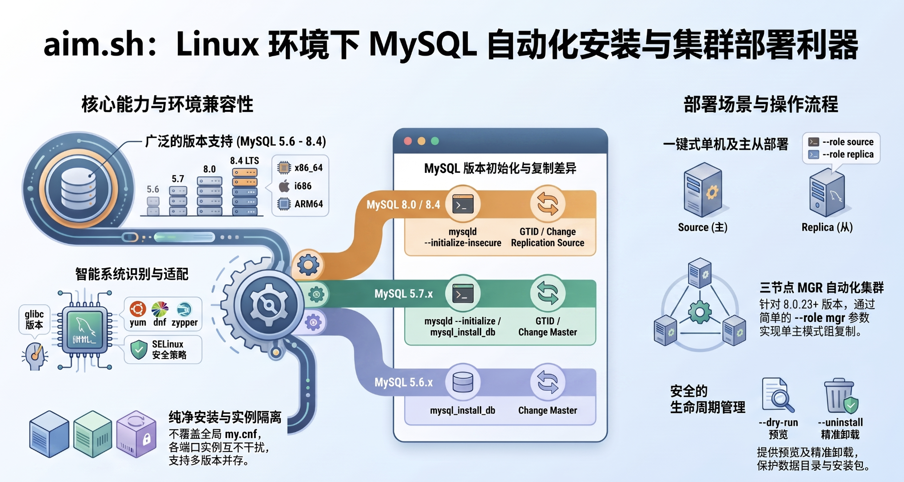

# aim.sh MySQL 控制台

aim.sh 是一个面向自托管环境的 MySQL 生命周期管理平台。它把主机纳管、安装介质管理、数据库部署、在线备份、健康监控、拓扑展示和审计集中到一个 Web 控制台，同时保留可独立运行的 `aim.sh` 命令行工具。

本 `aim` 分支只依赖 Docker、Linux 和 SSH，不绑定任何特定应用平台。



## 主要功能

### MySQL 安装与部署

- 支持 MySQL 5.6、5.7、8.0 和 8.4 官方 Generic Binary 安装包。
- 支持单机、独立主库、独立从库、一主一从和三节点单主 MGR。
- 支持 MGR 完成后接管为 InnoDB Cluster，并在三个节点部署 MySQL Router。
- 自动识别 Linux 发行版、CPU 架构、glibc、内存、磁盘和可用 IP。
- 支持目标机在线下载，也可上传 `.tar.xz`、`.tar.gz`、`.tgz` 或 `.tar` 安装介质。
- 上传文件采用 16 MiB 分片、断点续传和 SHA-256 校验，最大默认 2 GiB。
- 部署前统一检查主机状态、端口、架构、glibc、安装包和节点网络，MGR 按节点顺序执行。
- 高负载主机支持延长启动等待和安全续跑；失败部署可预览并清理残留。

### 实例与拓扑管理

- 管理实例启动、停止、状态检查、重新初始化和卸载。
- MySQL 实例按真实部署关系分组，主从、MGR 和独立实例不会混排。
- 拓扑页展示主库到从库的复制方向、MGR 成员、SQL/MGR 端点、在线状态和 Router 入口。
- 创建独立从库时可直接选择已有受管主库，自动带入源库地址和端口并建立拓扑关系。
- 部署向导可生成不含明文密码的 Bash 脚本，供审核、复制或在目标机独立执行。

### 在线备份

- 支持手动备份和五段 Cron 定时计划。
- 支持全库或指定数据库逻辑备份。
- 使用目标实例对应版本的 `mysqldump`，启用一致性读取、快速流式导出、存储过程、事件和触发器。
- 远端生成 gzip，控制台通过 SFTP 下载并再次校验 SHA-256。
- 支持按保留天数和保留份数自动清理。
- 默认保存到：

```text
/var/lib/aim-console/backups/<用户名>/<计划名>/<年>/<月>/
```

### 健康监控

- 主机：CPU、Load Average、内存、Swap 和磁盘可用空间。
- MySQL：运行时间、当前连接、运行中连接、最大连接、累计连接、Queries、Questions 和慢查询。
- 运行指标：收发流量、打开表、异常连接、InnoDB 缓冲池和表锁等待。
- 复制状态：复制 IO、复制 SQL 和复制延迟。
- 不在目标机安装常驻监控 Agent；按需通过受限执行器采集，单实例保存最近 240 条样本。

### 安全与审计

- 本地账号登录，支持 `admin`、`operator` 和 `viewer` 三种角色。
- SSH 主机指纹固定，防止目标主机被静默替换。
- SSH 私钥和 MySQL 密码使用 AES-256-GCM 加密后保存到 SQLite。
- 控制台主密钥通过 Docker Secret 单独挂载，不写入数据库。
- 目标机使用专用 `aimops` 用户和最小化 sudo 规则，只能运行 root 持有的受限执行器。
- 密码通过环境变量或标准输入传递，不进入远程命令行和任务日志。
- 部署、备份、实例操作、密码查看和用户管理均记录审计事件。
- 重新初始化、卸载和失败清理必须先预览并二次确认。

## 系统架构

```text
浏览器
  |
  v
Caddy HTTPS
  |
  v
aim-console (Go + Vue 3)
  |-- SQLite：配置、拓扑、任务、监控样本和审计
  |-- 持久化目录：安装介质与备份文件
  |
  +-- SSH/SFTP --> aimops --> sudo aim-executor
                                      |-- aim.sh
                                      +-- router.sh
```

控制台不要求目标主机开放额外的 HTTP 端口。日常管理通过 SSH 完成；MySQL、MGR 和 Router 端口是否开放，应根据实际业务网络和集群通信需求配置。

## 快速部署 Web 控制台

### 1. 准备环境

控制台主机需要：

- Docker Engine 24 或更高版本。
- Docker Compose v2。
- 能够通过 SSH 访问待纳管的 MySQL 主机。
- 建议至少 2 CPU、2 GiB 内存和足够的备份存储空间。

### 2. 获取代码

```bash
git clone --branch aim --single-branch https://github.com/aimdotsh/aim.git
cd aim
```

### 3. 创建配置和加密主密钥

```bash
cp .env.sample .env
mkdir -p secrets
openssl rand -base64 32 > secrets/aim_master_key
chmod 600 secrets/aim_master_key
```

编辑 `.env`，至少修改管理员密码和访问地址：

```dotenv
AIM_ADMIN_USER=admin
AIM_ADMIN_PASSWORD=请替换为至少12位的高强度密码
AIM_HTTPS_PORT=8443
AIM_TLS_HOSTS=localhost, 127.0.0.1, 192.168.31.10
AIM_MAX_UPLOAD_BYTES=2147483648
TZ=Asia/Shanghai
```

注意：

- `AIM_TLS_HOSTS` 必须包含浏览器实际访问使用的主机名或 IP，多个值用英文逗号分隔。
- 初始管理员只会在空数据库第一次启动时创建。以后修改 `.env` 不会重置已有密码。
- `secrets/aim_master_key` 丢失后，数据库中已加密的 SSH 私钥和 MySQL 密码将无法恢复，必须单独备份。

### 4. 启动服务

```bash
docker compose up -d --build
docker compose ps
docker compose logs -f console
```

浏览器访问：

```text
https://<控制台主机名或IP>:8443
```

Caddy 默认签发内部 CA 证书。首次访问出现证书提示属于预期行为；生产环境建议让客户端信任 Caddy 根证书，或替换为企业证书。

停止和升级：

```bash
# 停止，但保留数据库、安装介质和备份
docker compose down

# 获取 aim 分支更新并重建
git pull --ff-only
docker compose up -d --build
```

不要使用 `docker compose down -v`，除非确认要删除 `aim-data` 持久卷中的控制台数据。

## 初始化目标主机

控制台通过 Host Kit 为每台目标机安装专用账号、受限执行器、`aim.sh` 和 `router.sh`。

### 1. 下载 Host Kit

登录控制台后，在“主机资源”页面点击“下载 Host Kit 2.4.14”；也可以从仓库下载：

[下载 Host Kit 2.4.14](https://raw.githubusercontent.com/aimdotsh/aim/aim/web/public/downloads/aim-host-kit-2.4.14.tar.gz)

在能够 SSH 登录目标服务器的管理电脑上执行：

```bash
tar -xzf aim-host-kit-2.4.14.tar.gz
cd aim-host-kit-2.4.14
```

### 2. 安装到目标机

SSH 用户能够直接登录 root 时：

```bash
./aim-copy-id --install root@192.168.1.100
```

使用普通 sudo 用户、非默认端口或指定登录私钥时：

```bash
./aim-copy-id --install --port 2222 ubuntu@192.168.1.100

ssh-add ~/.ssh/my-login-key
./aim-copy-id --install ubuntu@192.168.1.100
```

这里用于登录目标机的个人 SSH 私钥，只负责完成初始化。`aim-copy-id` 会另外生成控制台专用密钥：

```text
私钥：~/.ssh/aim/aim_console_ed25519
公钥：~/.ssh/aim/aim_console_ed25519.pub
```

如果远端用户不能免交互执行 sudo，可先只上传：

```bash
./aim-copy-id ubuntu@192.168.1.100
```

然后按照命令输出，登录目标机并执行一次 `sudo .../install-staged-target.sh`。

### 3. 在控制台添加主机

进入“主机资源 → 添加受管主机”，填写：

- 主机名称：用于控制台识别，例如 `mysql-node-01`。
- IP 或域名：控制台能够 SSH 访问的地址。
- SSH 端口：默认 `22`。
- SSH 用户：Host Kit 默认创建的 `aimops`。
- 专用 SSH 私钥：导入 `~/.ssh/aim/aim_console_ed25519`，不要导入 `.pub` 公钥。

首次保存后确认服务器 SSH 指纹，再执行主机探测。只有显示 `ONLINE` 的主机才能进入部署流程。

重复运行同版本或新版 Host Kit 是幂等更新，不会删除已经安装的 MySQL 数据。控制台升级后若备份或监控提示执行器不支持相应 action，应在每台目标机重新运行新版 Host Kit。

## 使用部署向导

### 安装介质

在“安装介质”页面可以上传官方 MySQL Generic Binary 包。部署时：

- 有兼容的已上传介质：控制台通过 SFTP 发送到目标机，校验 SHA-256 后安装。
- 没有兼容介质或选择“目标机官方下载”：目标机根据版本、架构和 glibc 从 Oracle 下载。
- 使用离线介质时，应确保压缩包内包含 `bin/mysqld`，不要上传 `mysql-test-*` 测试套件。

### 部署模式

| 模式 | 节点 | 用途 |
|---|---:|---|
| 单机实例 | 1 | 独立开发、测试或普通数据库 |
| 仅主库 | 1 | 创建开启 GTID/binlog 的复制源 |
| 仅从库 | 1 | 为已有受管主库或外部源库增加从库 |
| 一主一从 | 2 | 同一次任务创建一套新的 GTID 主从 |
| 三节点 MGR | 3 | MySQL 8.0.23+ 单主模式 Group Replication |

MGR 部署要求三台节点之间的 SQL 端口和 MGR 通信端口双向可达。业务网 IP 必须是主机真实拥有且节点之间可以互访的地址，不能填写仅存在于云平台外部映射中的公网 NAT 地址。

启用 MySQL Router 后会占用四个连续端口：

| 端口 | 用途 |
|---:|---|
| `RW` | Classic 读写 |
| `RW + 1` | Classic 只读 |
| `RW + 2` | X 协议读写 |
| `RW + 3` | X 协议只读 |

部署过程和远程输出会实时写入“任务中心”。失败后应先阅读最后一条实际 MySQL 或系统错误，再选择“从失败节点重试”或“清理失败安装”。

## 备份与恢复注意事项

创建备份计划时选择实例、Cron 表达式、数据库范围和保留策略。点击“立即备份”后，控制台会：

1. 通过 SSH 调用目标机的受限执行器。
2. 在目标机临时目录生成 gzip 逻辑备份。
3. 通过 SFTP 下载到控制台备份目录。
4. 重新计算 SHA-256，成功后删除目标机临时文件。

备份是面向 InnoDB 的一致性逻辑备份。MyISAM 等非事务表不能保证处于完全相同的时间点。正式环境必须定期执行恢复演练；“备份任务成功”不等于恢复流程已经验证。

控制台备份至少应包含：

- Docker volume `aim-data`。
- `secrets/aim_master_key`。

默认备份目录位于 `aim-data` 卷内。如果需要改成独立磁盘，应同时修改 `docker-compose.yml` 中的 `AIM_BACKUP_ROOT`，并为新容器路径增加对应的 bind mount，避免文件随容器删除。

## 独立使用 aim.sh

Web 控制台不是必需组件。只管理单机或需要接入现有自动化系统时，可以直接使用 `aim.sh`。

```bash
# 方式一：克隆普通版分支
git clone --branch aim --single-branch https://github.com/aimdotsh/aim.git
cd aim
chmod +x aim.sh

# 方式二：只下载脚本
curl -fLo aim.sh https://raw.githubusercontent.com/aimdotsh/aim/aim/aim.sh
chmod +x aim.sh

# 先检查，不修改系统
./aim.sh -v 8.4.5 -p 3306 --role standalone --dry-run --skip-deps

# 安装单机实例
sudo ./aim.sh -v 8.4.5 -p 3306 --role standalone

# 查看状态
sudo ./aim.sh --status -v 8.4.5 -p 3306
```

一主一从示例：

```bash
# 主库 10.0.0.11
sudo AIM_REPL_PASSWORD='replace-with-strong-password' \
  ./aim.sh -v 8.0.46 -p 3306 --role source \
  --replica-host 10.0.0.12

# 从库 10.0.0.12
sudo AIM_SOURCE_PASSWORD='replace-with-strong-password' \
  ./aim.sh -v 8.0.46 -p 3306 --role replica \
  --source-host 10.0.0.11 --source-port 3306 --source-user aim_repl
```

生命周期操作：

```bash
sudo ./aim.sh --start  -v 8.0.46 -p 3306
sudo ./aim.sh --stop   -v 8.0.46 -p 3306
sudo ./aim.sh --status -v 8.0.46 -p 3306 --machine-readable --no-print-secrets

# 破坏性操作必须先预览
sudo ./aim.sh --uninstall -v 8.0.46 -p 3306 --dry-run
sudo AIM_ROOT_PASSWORD='root-password' \
  ./aim.sh --uninstall -v 8.0.46 -p 3306 --yes
```

查看完整参数：

```bash
./aim.sh --help
```

密码建议通过 `AIM_ROOT_PASSWORD`、`AIM_REPL_PASSWORD`、`AIM_SOURCE_PASSWORD` 和 `AIM_MGR_RECOVERY_PASSWORD` 等环境变量从秘密管理系统注入。直接把密码放进命令行参数可能被 Shell History 或进程列表记录。

## 支持范围

| 项目 | 支持情况 |
|---|---|
| MySQL | 5.6、5.7、8.0、8.4 |
| CPU | x86_64、i686、aarch64，取决于 Oracle 是否提供对应版本安装包 |
| Linux | RHEL/CentOS/Rocky/AlmaLinux/Oracle Linux/OpenCloudOS、Debian/Ubuntu、SLES/openSUSE 等 glibc 系统 |
| 初始化 | MySQL 5.6/早期 5.7 使用 `mysql_install_db`；新版使用 `mysqld --initialize-insecure` |
| 复制 | GTID 主从；根据版本使用 `CHANGE MASTER` 或 `CHANGE REPLICATION SOURCE` |
| MGR | MySQL 8.0.23 及以上，固定三节点单主模式 |
| Router | MGR 完成后使用 MySQL Shell 接管并部署 MySQL Router |

Alpine 等 musl 系统不能直接运行 Oracle Generic Binary。MySQL 5.6 和 5.7 已停止官方维护，生产环境应优先使用仍受支持的 8.0/8.4，并自行评估旧版本安全风险。

## 默认目录

### 控制台容器

```text
/var/lib/aim-console/aim.db       SQLite 数据库
/var/lib/aim-console/uploads      上传中的分片
/var/lib/aim-console/media        MySQL 安装介质
/var/lib/aim-console/backups      在线备份文件
```

### 目标 MySQL 主机

```text
/opt/mysql/<version>              MySQL 软件目录
/data/mysql/<port>/data           数据目录
/data/mysql/<port>/my.cnf         实例配置
/var/log/mysql/<port>             日志、binlog 和 relay log
/var/tmp/mysql/<port>             临时目录
/etc/systemd/system/aim-mysql-<port>.service
```

## 更多文档

- [Web 控制台部署与安全说明](docs/web-console.md)
- [Host Kit 使用说明](HOST-KIT.md)
- [Host Kit 详细协议与权限说明](docs/host-kit.md)
- [配置样例](config.sample)

## 开发与验证

```bash
# 前端
cd web
npm install
npm run test
npm run build
cd ..

# 后端
go test ./...

# 构建普通 Linux AMD64 镜像
docker build --platform linux/amd64 -t aim-mysql-console:local .
```
